# Include an Azure AD access token through a B2C token, as part of a B2C Sign In
> Disclaimer: This sample is provided AS IS - a best effort will be made to update this sample as the service evolves.

This sample builds on the built-in user flows, and shows how to include an Azure AD bearer token as a claim within a B2C token issued from a custom B2C sign in policy.  It also shows how to call the Graph API of the users’ home Azure AD tenant using the issued Azure AD token.  For reference, similar capability can be achieved to receive the original identity provider’s id token, using the built-in B2C user flows

https://docs.microsoft.com/en-us/azure/active-directory-b2c/idp-pass-through-user-flow

The following diagram overviews this sample:.

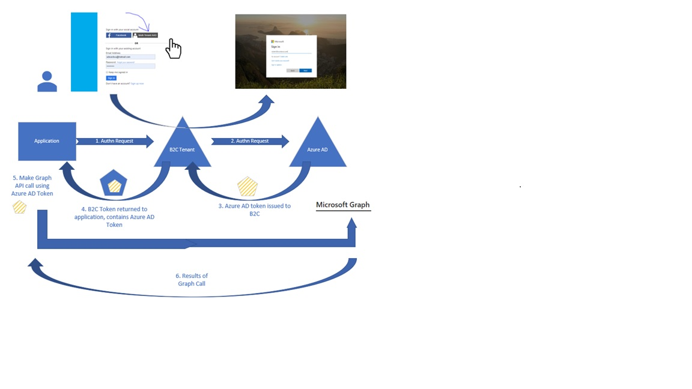

To configure the solution above, you will need to use Azure AD B2C Custom policies that use the Azure AD B2C Identity Experience Framework.  Review the getting started with custom B2C applications

https://docs.microsoft.com/en-us/azure/active-directory-b2c/active-directory-b2c-get-started-custom?tabs=applications
In the documentation, it references the B2C starter pack of advanced policies – download the starter pack, and use the policy files from the SocialAndLocalAccounts folder– which the use of both local and Azure AD accounts.   

We also recommend using Visual Studio Code and the B2C extensions for managing Custom policies, as there are many tools to simplify the configuration of the policies.

•	Download Visual Studio Code:  https://code.visualstudio.com/

•	Install Visual Studio Code Extension: Azure AD B2C  https://marketplace.visualstudio.com/items?itemName=AzureADB2CTools.aadb2c

**Register an application that allows users from Azure AD tenants to sign-in to your B2C tenant**

From the Azure AD B2C portal, select App registration, create a friendly name for the app, and select the “Accounts in any organization directory or any identity provider…” under the Supported Account Types.   This selection makes this a Multi-tenant application, that becomes available to any Azure AD tenant.  Details about multi-tenant Azure AD applications can be found here:  https://docs.microsoft.com/en-us/azure/active-directory/develop/howto-convert-app-to-be-multi-tenant

The reply url (redirect URI) should be your b2c tenant instance’s reply uRL  (replace “your-B2C-tenant-name” with your tenant’s name.).  
https://your-B2C-tenant-name.b2clogin.com/your-B2C-tenant-name.onmicrosoft.com/oauth2/authresp

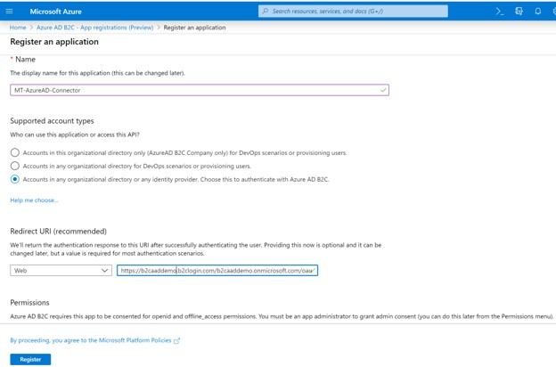 

Select Register.  After the application is successfully created, copy down the Application (client) id – which will be used in the B2C policy file (see below)

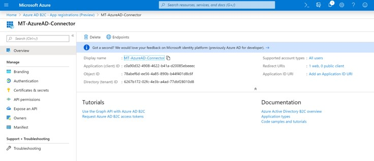

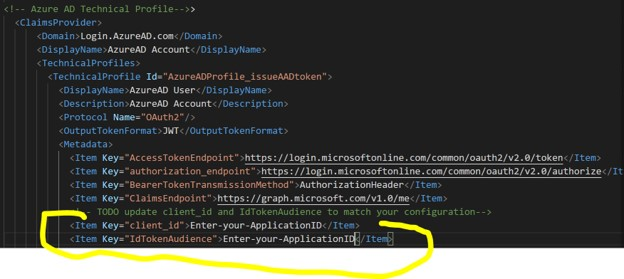

Next select, select API Permission, and select Add Permission.  Select Microsoft Graph and select Delegated Permissions.
 
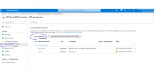

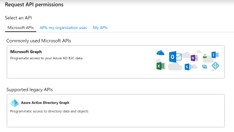

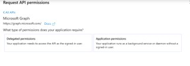

Then Select openid  and user.read and select the “Add Permissions” button to save your configuration.  
       
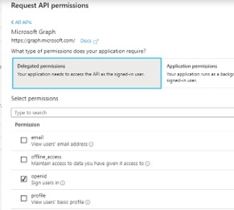

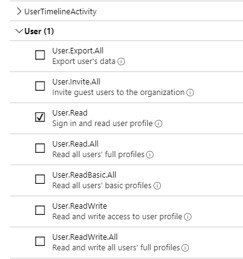

Your summarized application permissions should look like the following screen.

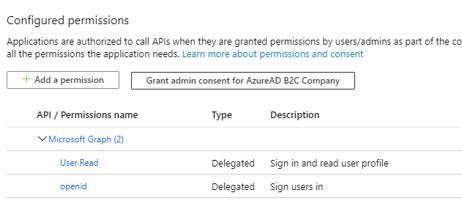 

Note: other delegated permissions could have been selected – however, some may need Admin consent before the user will be able to sign into your application. A  best practice is to request the minimum permissions needed by your application.  If you find that additional permissions are needed, you can add them later – users and administrators may need to re-consent to the new permissions.

**Updating the B2C Policy Permissions and Client Secret**

A client Secret associated with this application, must be created – select either 1 or 2 year expiration (select no expiration for testing purposes only).  

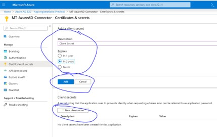
 
Copy the client secret – in the next steps, we will need to store the value in a B2C policy key location, and reference the key location from withing the Azure AD technical profile in the B2C policy file.  

**Add the Application Secret to the Identity Experience Framework Policy Key**

Create a B2C policy key (under the Identity Experience Framework blade).  Select Manual for the Option, create a name (we will reference this policyKeyName in the next step), and enter the client secret value from the previous step.

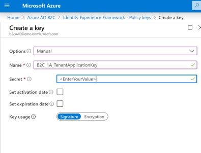

**Updating the AzureADProfile_issueAADToken technical profile in the B2C policy file**
The application (client ID) and the permissions must be updated in the AzureAD technical profile in your B2C policy file.   First update the values for the client_id and the IdTokenAudience in the policy file.

Update the Scope value to equal the permissions that you configured for your.  This should be openid and user.read.   Note: for mutliple scopes, each scope value should be separated by a space.  
      <Item Key="scope">openid user.read</Item>

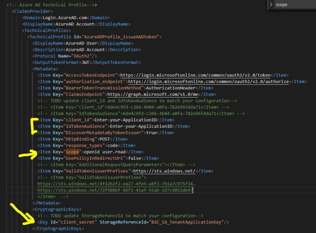  

**First Sign In experience for users**
During the first-time user logon from an Azure AD tenant, users will be able to consent to Microsoft Graph permissions if the requested permissions do not require administrator consent.

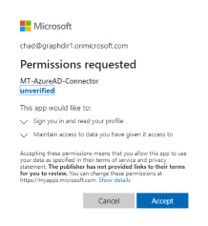   

Administrators can consent on behalf of all users in their organization – after this consent, users will not see request for consent.

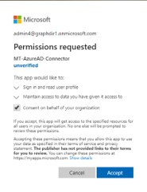   
 

Some permissions require the company administrator’s consent, therefore users are not authorized to consent individually.  In this case, users will be blocked from sign in until the company administrator logons to the app and consents on behalf of all users in their organization.

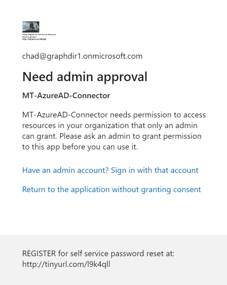 
         
Figure 1 User cannot logon nor consent to an app requesting privileged permissions

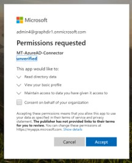 
              
Figure 2 Admin Can consent for the organization

**Calling the Graph API using the access token**

Upon successful user sign on, the original Azure AD idp access token will  be part of the B2C token.  This idp access token can be used to access the users’ home Azure AD tenant’s Graph API (with the scope of Directory.Read)   For example:

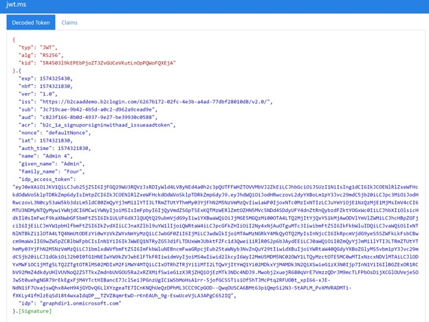 
 

The idp access_token, is base64 encoded and can be viewed:

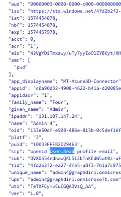 
 

Calls to the Microsoft Graph Call can now be made, using this idp access token in the authorization header.  
Example:

https://graph.microsoft.com/beta/users/chad@deployit.info

Authorization:  eyJ0eXAiOiJKV1Qi……. DUxWmJUbktFZFc1

Microsoft Graph Call Result:

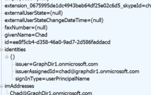 

## Community Help and Support
Use [Stack Overflow](https://stackoverflow.com/questions/tagged/azure-ad-b2c) to get support from the community. Ask your questions on Stack Overflow first and browse existing issues to see if someone has asked your question before. Make sure that your questions or comments are tagged with [azure-ad-b2c].

If you find a bug in the sample, please raise the issue on [GitHub Issues](https://github.com/azure-ad-b2c/samples/issues).

To provide product feedback, visit the [Azure Active Directory B2C Feedback page](https://feedback.azure.com/forums/169401-azure-active-directory?category_id=160596).
