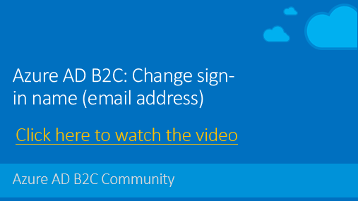

# Azure AD B2C: Change local account sign-in name (email address)

When sign-in with local account, a user may want to change the sign-in name (email address). This sample policy demonstrates how to allow user to provide and validate new email address, and store the new email address to Azure Active Directory user account. After user change the email address, on the next login, user needs to provide the new email address as sign-in name.

The solution is base on new `B2C_1A_ChangeSignInName` relying party policy. The policy invokes `ChangeSignInName` user journey which:
1. Asks the user to sign-in with a local account
1. Reads the user data from the Azure Active Directory
1. Collects and validate the new email address
1. Persists the new sign-in name to the directory

To change user's email address, call the `B2C_1A_ChangeSignInName` relying party policy.

> Note:  This sample policy is based on [SocialAndLocalAccounts starter pack](../../../SocialAndLocalAccounts). All changes are marked with **Demo:** comment inside the policy XML files.
