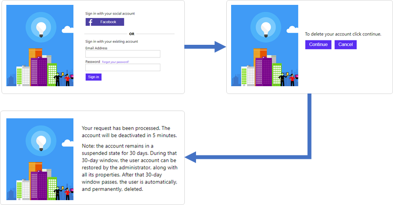

# Delete my account

This sample policy shows how to delete a local or social account from the directory. To delete an account, user needs to sign-in. The policy checks whether the account exists in the directory (specially for social account that user can sign-in first time). If account exists, the policy presents a warning page and let the user choose to continue. On continue, the policy invokes an Azure AD technical profile that deletes the account and present the account has been deleted message. 

## Community Help and Support
Use [Stack Overflow](https://stackoverflow.com/questions/tagged/azure-ad-b2c) to get support from the community. Ask your questions on Stack Overflow first and browse existing issues to see if someone has asked your question before. Make sure that your questions or comments are tagged with [azure-ad-b2c].
If you find a bug in the sample, please raise the issue on [GitHub Issues](https://github.com/azure-ad-b2c/samples/issues).
To provide product feedback, visit the Azure Active Directory B2C [Feedback page](https://feedback.azure.com/forums/169401-azure-active-directory?category_id=160596).

## Notes
This sample policy is based on [SocialAndLocalAccounts starter pack](https://github.com/Azure-Samples/active-directory-b2c-custom-policy-starterpack/tree/master/SocialAndLocalAccounts). All changes are marked with **Sample:** comment inside the policy XML files. Make the necessary changes in the **Sample action required** sections. 
