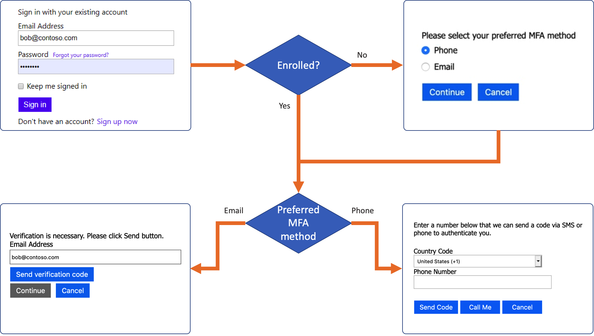

# A B2C IEF Custom Policy - Sign in with MFA method choice (Phone/Email)

## Community Help and Support
Use [Stack Overflow](https://stackoverflow.com/questions/tagged/azure-ad-b2c) to get support from the community. Ask your questions on Stack Overflow first and browse existing issues to see if someone has asked your question before. Make sure that your questions or comments are tagged with [azure-ad-b2c].
If you find a bug in the sample, please raise the issue on [GitHub Issues](https://github.com/azure-ad-b2c/samples/issues).
To provide product feedback, visit the Azure Active Directory B2C [Feedback page](https://feedback.azure.com/forums/169401-azure-active-directory?category_id=160596).

## Scenario
For scenarios where you would like to give users the choice to use Email verification or SMS/Phone Call as the second authentication factor, and allow them to change this choice at a later point via Profile Edit.

User flow:
1. When the user signs-up or signs-in, where the user attribute for `extension_mfaByPhoneOrEmail` does not exist, the user is prompted to make a selection via a radio box.
1. If the MFA preferred MFA method is:
    1. **phone**, the `PhoneFactor-InputOrVerify"` technical profile is executed, to enroll or verify the phone number.
    1. **email**  the `EmailVerifyOnSignIn` technical profile is executed, to enroll or verify the email address.
1. New enrolled MFA is persisted to the directory.

## Unit Tests
1. Sign Up and verify the MFA Method is selectable. 
2. Sign In and verify the expected MFA Method is prompted for.
3. Run the Profile Edit policy and change the MFA Method, repeat the Sign In for both methods to make sure the choice is respected.
4. Run the password reset journey and confirm the MFA method is respected.