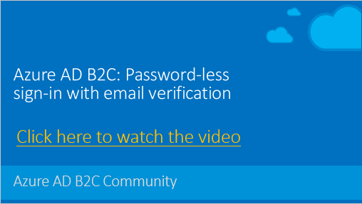

# Azure AD B2C: Password-less sign-in with email verification
Passwordless authentication is a type of authentication where user doesn't need to sign-in with their password. This is commonly used in B2C scenarios where users use your application infrequently and tend to forget their password. This sample policy demonstrates how to allow user to sign-in, simply by providing and verifying the sign-in email address using OTP code (one time password). 

[](https://youtu.be/bzqMDPnV5G0)

## Solution flow
The sample policy includes following user journey:
* Sign-in with a local account with password
* Social account. 
* Password-less sign-in with local account only.

## Adding this functionality to your policy
In your extension policy:
1.	Add the **LocalAccountDiscoveryUsingEmailAddress-SignIn** technical profile. The technical profile is based on the password reset technical profile (LocalAccountDiscoveryUsingEmailAddress) that asks the user to provide and verify the email address, and returns the user object id. If the account doesn't exist, the technical profile return following error message "An account could not be found for the provided user ID." The technical profile sets the display name to "Sign-In with Email" that is shown on the sign-up or sign-in page.
    ```XML
    <ClaimsProvider>
      <DisplayName>Local Account</DisplayName>
      <TechnicalProfiles>
        <TechnicalProfile Id="LocalAccountDiscoveryUsingEmailAddress-SignIn">
          <DisplayName>Sign-In with Email</DisplayName>
          <IncludeTechnicalProfile ReferenceId="LocalAccountDiscoveryUsingEmailAddress" />
        </TechnicalProfile>
      </TechnicalProfiles>
    </ClaimsProvider>
    ```

1. Add the sign-in with email button. The ClaimsProviderSelection element is analogous to an identity provider button on a sign-up/sign-in screen. If you add a ClaimsProviderSelection element for sign-in with email, a new button shows up when a user lands on the page. Find the OrchestrationStep element that includes `Order="1"` in the user journey that you created. Under ClaimsProviderSelects, add the following element. Set the value of TargetClaimsExchangeId to an appropriate value, for example `SignIn-WithEmail`.
    ```XML
    <ClaimsProviderSelection TargetClaimsExchangeId="SignIn-WithEmail" />
    ```

1. Link the button to an action. Find the OrchestrationStep that includes `Order="2"` in the user journey. Add the following ClaimsExchange element making sure that you use the same value for Id that you used for TargetClaimsExchangeId:
    ```XML
    <ClaimsExchange Id="SignIn-WithEmail" TechnicalProfileReferenceId="LocalAccountDiscoveryUsingEmailAddress-SignIn" />
    ```

## Tests
You should run at least following acceptance tests:
- Create new local account
- Sign-in with account you created using username and password
- **Sign-in with email** - try to sign-in with the account you create, using email verification
- **Sign-in with email** - try to sign-in with an email address that dosn't exists in the directory. You should see an error message: _An account could not be found for the provided user ID._

> Note:  This sample policy is based on [SocialAndLocalAccounts starter pack](../../../SocialAndLocalAccounts). All changes are marked with **Sample:** comment inside the policy XML files. Make the necessary changes in the **Sample action required** sections.

## Disclaimer
The sample policy is developed and managed by the open-source community in GitHub. The policy is not part of Azure AD B2C product and it's not supported under any Microsoft standard support program or service. The app is provided AS IS without warranty of any kind. 

