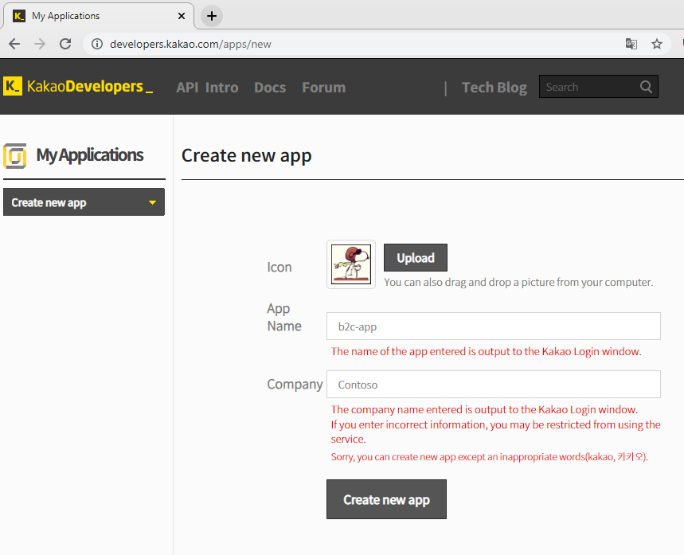
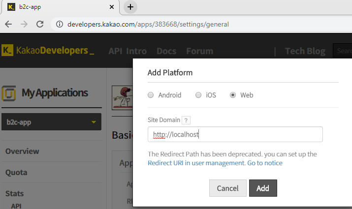
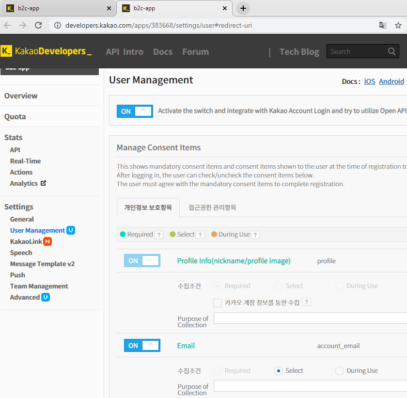
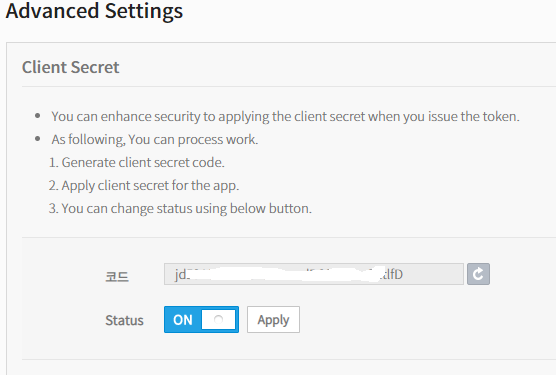
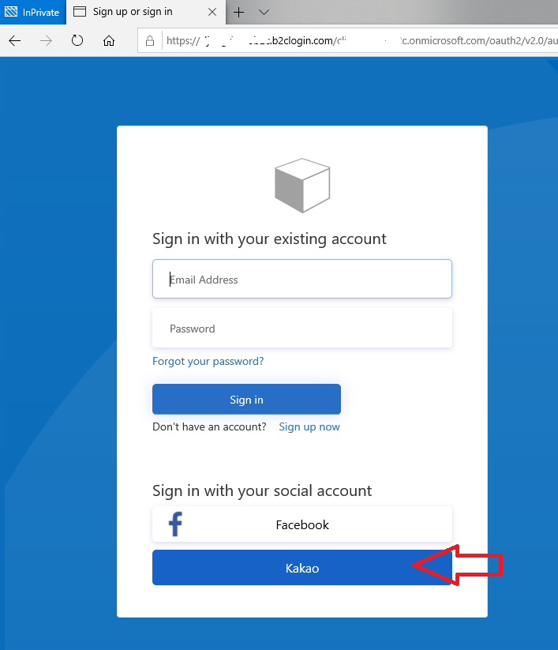

# Setting up **Sign in with Kakao** as a Custom OAuth2 provider

This sample shows how to setup **Kakao** as an identity provider in Azure AD B2C. **Kakao** is a South Korean Internet company that provides a diverse set of services.

The documentation for [setting up sign-in with Google using custom policies](https://docs.microsoft.com/en-us/azure/active-directory-b2c/active-directory-b2c-custom-setup-goog-idp) is a good start if you want to understand how this policy was created

## Kakao Developer Platform steps
You need to create your account at [KakaoDevelopers_](https://developers.kakao.com/apps) first and then create your app registration

1. Select **+Create new app** in the drop down menu and give your app a name

2. Add Platform **Web** and enter a rui in the Site Domain. This is not the Redirect URI and do not need to be valid

3. Activate the app under **User Management**, and add profile and email as **Consent Items** so they are returned as claims

4. In the **Redirect URI**, fill in the B2C redirect url (replace yourtenant for your tenant)
`https://yourtenant.b2clogin.com/yourtenant.onmicrosoft.com/oauth2/authresp`

5. Under ***Settings > General***, copy the ***REST API Key*** and save it. It is your client_id
6. Under ***Settings > Advanced***, create a Client Secret and save it. It is your client_secret and we need to add it to the B2C portal

## Azure Portal
You need to create a policy key as explained in the [documentation](https://docs.microsoft.com/en-us/azure/active-directory-b2c/active-directory-b2c-custom-setup-goog-idp?tabs=applications#create-a-policy-key). Name the policy key `B2C_1A_KakaoAppSecret` and set the value to the client secret you generated in step 6 above.

## Edit and upload the Custom Policy
The file [SignUpOrSigninWithKakao.xml](SignUpOrSigninWithKakao.xml) is based on the [SocialAndLocalAccounts](https://github.com/Azure-Samples/active-directory-b2c-custom-policy-starterpack/tree/master/SocialAndLocalAccounts) from the Azure AD B2C Custom Policy Starter Pack.

Changes you need to do are:

1. Replace All of yourtenant to the name of your tenant
2. Change the PolicyIds to your liking. Note that the BasePolicyId is named B2C_1A_**Kakao**_TrustFrameworkExtensions 
3. Replace the client_id value in the ClaimsProvider section with the value from step 5 above.
4. In the RelyingParty section at the bottom, add your own ApplicationInsight key

Then upload the policy and you are ready to test run it.

## Signing in with Kakao
When you test run your policy, you should see a button labeled **Kakao**

Clicking that button will take you to Kakao's login page. The first time you need to accept the Consent, but then you will be redirected back to B2C and continue with completing your self asserted information. Kakao will only emit the email, the users unique identifier and the users nickname.

## Community Help and Support
Use [Stack Overflow](https://stackoverflow.com/questions/tagged/azure-ad-b2c) to get support from the community. Ask your questions on Stack Overflow first and browse existing issues to see if someone has asked your question before. Make sure that your questions or comments are tagged with [azure-ad-b2c].

If you find a bug in the sample, please raise the issue on [GitHub Issues](https://github.com/azure-ad-b2c/samples/issues).

To provide product feedback, visit the [Azure Active Directory B2C Feedback page](https://feedback.azure.com/forums/169401-azure-active-directory?category_id=160596).
