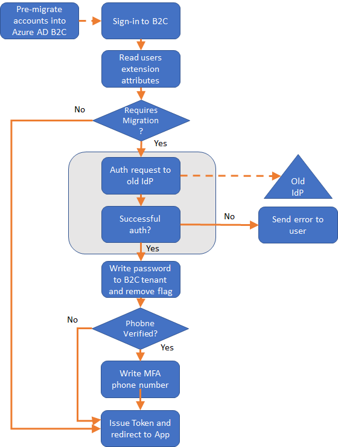

# Migrating CIAM solution from AWS Cognito to B2C

This is an end-to-end sample for migrating the users from AWS Cognito to Azure AD B2C. Its intended purpose is to give you a sample where you can go through all steps in a real migration scenario. It includes scripts for setting up AWS Cognito UserPools, importing users, migrating the users from AWS to B2C, using Custom Policies for seamless migrating users' passwords and MFA phone to B2C at next login. Please note that there is no special reason to why AWS Cognito was choosen other then it suited the purposes to illustrate how you migrate from something to B2C. 

When you run through this sample, as a demo or excercise, you will be able to complete it in ~30 minutes including all manual steps.

## AWS Prerequisits
In order to run this demo end-to-end you need an AWS Account and AWS cli installed on your laptop. 

## Seamless migration flow during Sign In

What happens during signin when the users are migrated to B2C is illustrated in the below diagram

 

During the sign in, the B2C Custom Policy will read the user object and check the attribute ``requiresMigration`` to see if the user is in a state where migration needs to be completed. If so, since B2C does not know the password of the user, we pass the userid/password to AWS Cognito and ask it to authenticate the user. If AWS Cognito successfully can authenticate the user, B2C writes the verified password to the B2C tenant and flips tha ``requiresMigration`` flag. Then, if we do have a migrated mobile phone number that AWS Cognito says is verified, we trust that and set that as the MFA phone number. 

## How to get started

1. Follow the [AWS instruction](aws/README.md) for how to deploy a working AWS Cognito environment
2. Follow the first part of the [website instructions](website/README.md) for how to verify your dpeloyment with AWS Cognito
3. Follow the [B2C instructions](b2c/README.md) for how to migrate the users and deploy the B2C Custom Policies, etc.
4. Follow the second part of the [website instructions](website/README.md) for how to verify your dpeloyment Azure AD B2C

## Community Help and Support
Use [Stack Overflow](https://stackoverflow.com/questions/tagged/azure-ad-b2c) to get support from the community. Ask your questions on Stack Overflow first and browse existing issues to see if someone has asked your question before. Make sure that your questions or comments are tagged with [azure-ad-b2c].

If you find a bug in the sample, please raise the issue on [GitHub Issues](https://github.com/azure-ad-b2c/samples/issues).

To provide product feedback, visit the [Azure Active Directory B2C Feedback page](https://feedback.azure.com/forums/169401-azure-active-directory?category_id=160596).
